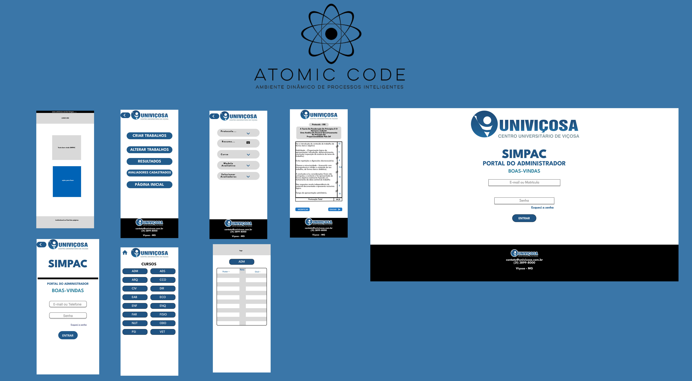

<h1 align="center">Projeto – Evoluir.Ti</h1>

- <a href="#introducao">Introdução</a>
- <a href="#objetivos">Objetivos do Projeto</a>
- <a href="#desafio">Desafio</a>
- <a href="#prototipo">Prototipação</a>
- <a href="#stakeholders">Stakeholders</a>
- <a href="#personas">Personas</a>
- <a href="#mapa_empatia">Mapa de Empatia</a>
- <a href="#fluxograma">Fluxograma</a>
- <a href="#wireframe">Wireframe</a>
- <a href="#conclusao">Conclusão</a>

<h2 id="introducao">Introdução</h2>

É um projeto idealizado para solucionar os desafios na hora da avaliação dos trabalhos dos alunos da Univiçosa durante o Simpósio de Produção Acadêmica - SIMPAC. Dentre os desafios, está a automatização da organização de projetos, otimização do tempo e a melhora da entrega dos resultados. De acordo com a demanda proposta pela CEO da NUPEX (Núcleo de Apoio à Pesquisa e Extensão da Univiçosa) Eliene da Silva Martins Viana, o que antes era feito no papel, agora terá que ser implementado em uma aplicação web responsiva que estará disponível para dispositivos móveis e também para desktops.

Pela grande falta de praticidade na hora das avaliações e por terem que entregar uma folha preenchida com cada grupo para cada avaliador, nossa aplicação será de uma grande ajuda, visto que ela automatizará toda essa questão de gestão de trabalhos e suas respectivas notas, o que poupará tempo e dinheiro.

## Especificação de Requisitos

<h3 id="objetivos">Objetivos do Projeto</h3>

O principal objetivo desse projeto é entregar a melhor experiência possível para os administradores e avaliadores dos trabalhos, tornando o evento do SIMPAC mais dinâmico e organizado. Mas não só isso, também focamos em entregar uma aplicação que esteja disponível para que os mais diversos usuários possam desfrutar dos trabalhos entregues pelos alunos, seja por curiosidade, por fins acadêmicos ou até mesmo para inspiração.

<h3 id="desafio">Desafio</h3>

- Garantir a atribuição equitativa, eficiente e apropriada de avaliadores para os trabalhos, levando em consideração a disponibilidade de cada um.
- Agilizar a coleta e o processamento das notas de forma mais automatizada.
- Assegurar a justiça e imparcialidade nas avaliações, mantendo a qualidade.
- Gerenciar uma alta carga de trabalho, incluindo a avaliação simultânea de múltiplos trabalhos.

<h2 id="prototipo">Prototipação</h2>

Link para o protótipo no Figma:
https://www.figma.com/file/3RcvZjYx66Hn4ibVR8qiTA/SIMPAC-PROJETO?type=design&node-id=0%3A1&mode=design&t=T04ho3tIh2vIzivS-1

## Análise de Tarefas, Usuário e Funções

<h3 id="stakeholders">Stakeholders</h3>

- Gestores/Organizadores do SIMPAC
- Avaliadores e Grupos Avaliados
- Público Afetado pelos Resultados

<h3 id="personas">Personas</h3>

Baseado no storytelling, as personas foram criadas para representar os stakeholders.

<h3 id="mapa_empatia">Mapa de Empatia</h3>

- Para entender melhor as necessidades dos stakeholders, utilizamos o mapa de empatia, assim tivemos uma visão de onde focar nossos estudos para criarmos uma solução de agrado a todos.

## Projeto Conceitual e Especificaçao do Design

<h3 id="fluxograma">Fluxograma</h3>

- Foi organizado um fluxograma para orgarnizar as informações, identificar ações que podem ser feitas para os objetivos da organização ou avaliador.

<h3 id="wireframe">Wireframe</h3>

A partir do fluxograma, foi criado então o wireframe, que é uma representação visual básica e esquemática da estrutura de nossa aplicação web. Seu objetivo principal pe definir a distribuição de elementos da natela, sem se preocupar muito com detalhes visuais.

- Pela tela inicial será possível observar informações como em qual edição o evento se encontra. E qual caminho o usuario gostaria de seguir.
- Para todas escolhas elas serão necessárias um login para confirmar a identidade porém alguns podem ser organizadores e terão um maior nível de acesso.
- O administrador poderá criar os trabalhos para serem avaliados, alterar eles caso tenham cometido erros ou até mesmo apagar, conferir os resultados, checar os avaliadores cadastrados além de poder adicionar ou excluir caso seja necessário.
-  O Avaliador quando terminar suas avaliações lhe será mostrado uma tabela com informações de seus votos e caso o mesmo queira trocar ele terá a oportunidade.
- Para os resultados, que serão disponíveis apenas à organização do evento, lhe será disposto um login e ao entrar, basta escolher o curso que deseja olhar no momento, e será mostrado uma tabela com as notas tanto em poster quanto apresentações orais.

<h2 id="conclusao">Conclusão</h2>

A aplicação se encontra na metade do caminho, temos uma boa base de requisitos já definidos e validados, protótipos de baixo e de médio nível, como também, um de alto nível muito dinâmico e intuitivo. Também temos nossas personas, mapas de empatia e fluxograma.

Para nossa próxima etapa, iremos refinar tudo que já fizemos até então, através de levantamentos de requisitos de baixo nível, de testes, re-design se preciso, entre outros métodos. Também criaremos uma documentação mais detalhada, tudo para facilitar a etapa final que é a implementação. Mais detalhes do protótipo se
encontra no link: https://github.com/ViniFontes73/ProjetoSIMPAC