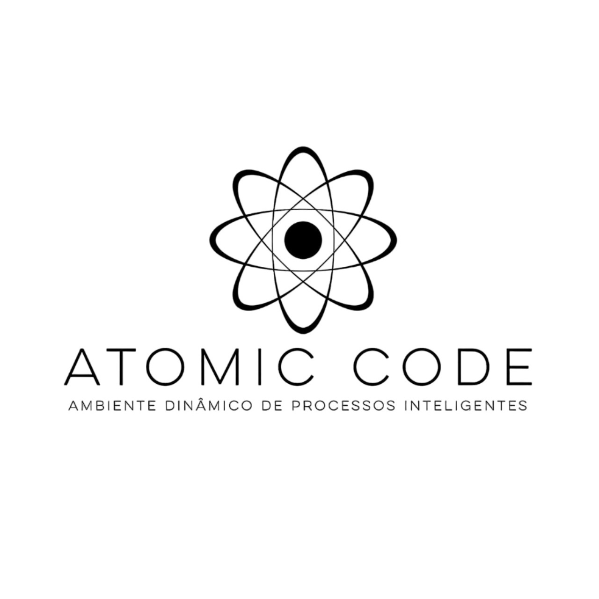
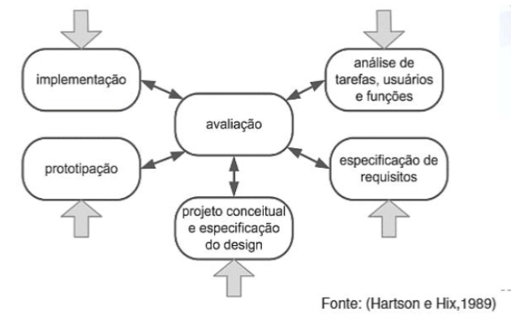
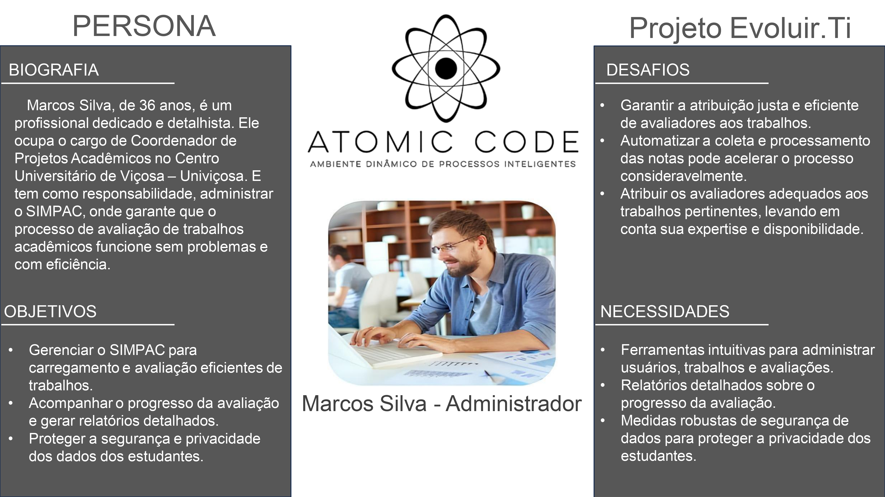
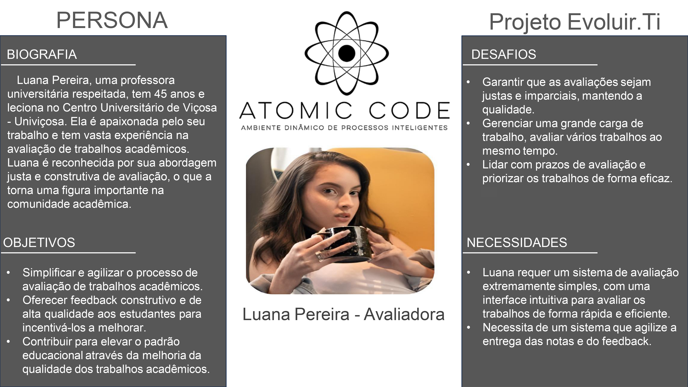
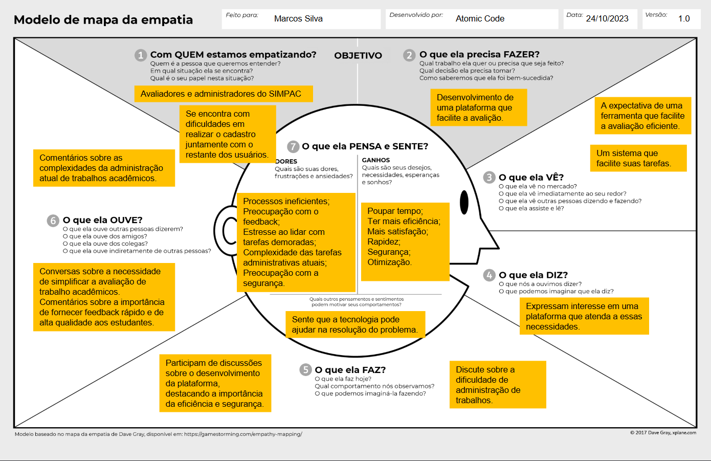
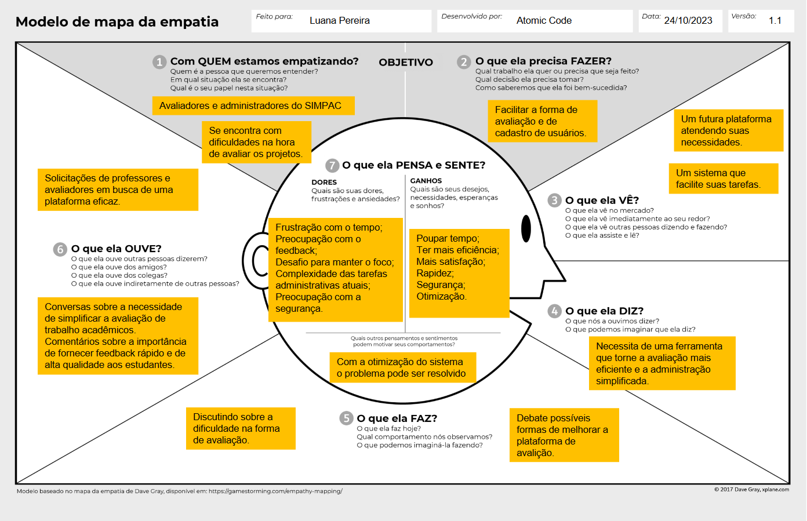

<h1 align="center">Projeto – Evoluir.Ti</h1>

    

# Sumário

- <a href="#introducao">Introdução</a>
- <a href="#ciclo_vida">Ciclo de Vida</a>
- <a href="#analise_de_tarefas">Análise de Tarefas, Usuário e Funções</a>
- <a href="#requisitos">Engenharia de Requisitos</a>
- <a href="#projeto_conceitual">Projeto Conceitual e Especificaçao do Design</a>
- <a href="#prototipacao">Prototipação</a>
- <a href="#implementacao">Implementação</a>
- <a href="#conclusao">Conclusão</a>

<h1 id="introducao">1. Introdução</h1>

É um projeto idealizado para solucionar os desafios na hora da avaliação dos trabalhos dos alunos da Univiçosa durante o Simpósio de Produção Acadêmica - SIMPAC. Dentre os desafios, está a automatização da organização de projetos, otimização do tempo e a melhora da entrega dos resultados. De acordo com a demanda proposta pela CEO da NUPEX (Núcleo de Apoio à Pesquisa e Extensão da Univiçosa) Eliene da Silva Martins Viana, o que antes era feito no papel, agora terá que ser implementado em uma aplicação web responsiva que estará disponível para dispositivos móveis e também para desktops.

Pela grande falta de praticidade na hora das avaliações e por terem que entregar uma folha preenchida com cada grupo para cada avaliador, nossa aplicação será de uma grande ajuda, visto que ela automatizará toda essa questão de gestão de trabalhos e suas respectivas notas, o que poupará tempo e dinheiro.

<h1 id="ciclo_vida">2. Ciclo de Vida</h1>

Um modelo de ciclo de vida nas atividades de design de interfaces é um
framework ou abordagem que descreve as etapas pelas quais um projeto de
interface passa, desde o conceito inicial até a implementação e manutenção.
Ele fornece uma estrutura para os designers seguirem e ajuda a garantir que
todos os aspectos do design sejam considerados e tratados adequadamente
ao longo do processo. O modelo utilizado no projeto Evoluir.Ti foi o Modelo
Estrela (Hartson e Hix, 1989).

## 2.1. Modelo Estrela

O modelo estrela de design de interfaces, também conhecido como “Star Model”, é um modelo de ciclo de vida com uma abordagem que visa criar interfaces de usuário eficazes e centradas no usuário. Este modelo é chamado assim devido à sua estrutura central, que é cercada por cinco componentes principais, semelhantes aos raios de estrela.

    
    
Figura 1 - Modelo de Ciclo de Vida Estrela

<h1 id="analise_de_tarefas">3. Análise de Tarefas, Usuário e Funções</h1>

## 3.1. Cenário Atual

Atualmente, o processo de avaliação e entrega do SIMPAC é realizado de forma manual. Este processo envolve a coleta de avaliações dos trabalhos acadêmicos em formato de papel. Tal abordagem resulta em alguns problemas:
1. **Erros Humanos:** A manipulação manual dos documentos aumenta a probabilidade de erros, tanto na coleta quanto na avaliação dos trabalhos.
2. **Ineficiente e Demorado:** A necessidade de lidar com documentos físicos torna o processo lento e ineficiente, causando atrasos significativos e dificultando a gestão das avaliações.
3. **Precisão dos Resultados:** A precisão dos resultados é comprometida, uma vez que a natureza manual do processo aumenta a possibilidade de erros e inconsistências na avaliação dos trabalhos.

## 3.2 Análise de Tarefas

Para transformar o processo manual em uma aplicação web responsiva, é necessário
identificar e analisar cada tarefa envolvida.

### 3.2.1. Submissão dos trabalhos:
- **Usuários:** Alunos
- **Tarefa:** Submeter trabalhos acadêmicos via plataforma online.
- **Função necessária:** Formulário de submissão com suporte a uploads de arquivos.
### 3.2.2. Organização dos trabalhos:
- **Usuários:** Administradores
- **Tarefa:** Classificar e organizar trabalhos submetidos por esses alunos e designar
trabalhos aos avaliadores, compilar e calcular resultados das avaliações feitas por
esses avaliadores.
- **Função necessária:** uma interface com gerenciamento dos trabalhos submetidos
com filtragem e categorização e um Sistema de distribuição automatizada com
notificações. Sistema de tabulação automática com geração de relatórios.
### 3.2.3. Avaliação:
- **Usuários:** Avaliadores
- **Tarefa:** Avaliar trabalhos e inserir notas/comentários aos alunos.
- **Função necessária:** Interface de avaliação com campos para notas e
comentários.
### 3.2.4. Divulgação dos resultados:
- **Usuários:** tanta pode ser alunos quanto avaliadores e administradores
- **Tarefa:** Acessar os resultados das avaliações submetidas .
- **Função necessária:** Página de resultados fácil e acessível ao usuário com opções de exportação a esses resultados .

## 3.3. Storytelling

Há muito tempo, em um mundo acadêmico não tão distante, um dedicado organizador enfrentava um desafio épico. Seu nome era Marcos, e ele liderava a organização do SIMPAC, um prestigiado simpósio de produção acadêmica. A missão de Marcos era grandiosa: garantir que cada participante recebesse uma avaliação justa e rápida.

No entanto, o destino lhe impôs um obstáculo formidável. Cada processo avaliativo exigia horas intermináveis de trabalho manual, desde a separação dos projetos até o redirecionamento correto. E como se isso não bastasse, o cálculo das notas finais era uma tarefa hercúlea, consumindo não apenas o tempo de Marcos, mas também a paciência de todos os envolvidos.

Em meio a esse cenário desafiador, surge uma luz de esperança. Uma solução inovadora, construída com maestria em Design de Interação (UI) e Experiência do Usuário (UX), estava prestes a transformar a jornada de Marcos. Essa ferramenta revolucionária prometia aliviar o fardo do trabalho manual, trazendo eficiência e agilidade ao processo avaliativo.

Ao adotar essa solução, Marcos não apenas se libertou das amarras do trabalho tedioso, mas também se tornou uma verdadeira heroí na busca por resultados rápidos e justos. O SIMPAC, antes repleto de desafios, floresceu com uma entrega de resultados que deixou todos boquiabertos.

E assim, a história de Marcos e a ferramenta de Design de Interação se tornou um conto lendário no mundo acadêmico. O SIMPAC não era mais apenas um simpósio, mas sim um exemplo vivo de como a inovação, aliada ao design inteligente, pode transformar desafios em triunfos.

No final, Marcos não era apenas um organizador; ela se tornou uma verdadeiro guardião da eficiência, mostrando que, com a ferramenta certa, até mesmo os desafios mais formidáveis podem ser superados. E assim, a cada SIMPAC subsequente, a lembrança da jornada de Marcos continuava a inspirar e guiar aqueles que buscavam a excelência na produção acadêmica.

## 3.4. Stakeholders

- Gestores/Organizadores do SIMPAC
- Avaliadores e Grupos Avaliados
- Público Afetado pelos Resultados

## 3.5. Personas

Baseado no storytelling, as personas foram criadas para representar os stakeholders.

    
    
Figura 2 - Persona do Marcos Silva

    
    
Figura 3 - Persona da Luana Pereira

## 3.6. Mapa de Empatia

Para entender melhor as necessidades dos stakeholders, utilizamos o mapa de empatia, assim tivemos uma visão de onde focar nossos estudos para criarmos uma solução de agrado a todos.

    
    
Figura 4 - Mapa de Empatia do Marcos Silva

    
    
Figura 5 - Mapa de Empatia da Luana Pereira

## Avaliação da Análise de Tarefas, Usuário e Funções

Em uma conversa virtual, apresentamos à cliente todas as nossas análises. Ela ressaltou a necessidade de que a nova demanda fosse diferente do sistema atualmente em uso. A cliente destacou que seria de grande ajuda ter acesso ao sistema por dispositivos móveis, tanto Android quanto iOS. Além disso, ela mencionou a importância de permitir que o avaliador pudesse avaliar os resumos durante as sessões de pôster e oral. No entanto, com exceção desses pontos, ela concordou com o restante das análises e apresentadas.

<h1 id="requisitos">4. Engenharia de Requisitos</h1>

## 4.1. Especificação de Requisitos

### 4.1.1. Elicitação de Requisitos

Em uma reunião virtual em 4 de outubro de 2023, liderada pelo PO Vinicius Fontes, foram levantados os requisitos para o projeto da Atomic Code. A cliente destacou a necessidade de automatizar o processo manual de avaliação do SIMPAC, tornando-o mais simples e rápido. Decidiu-se criar uma prototipagem de uma aplicação web acessível por celular durante as avaliações, em vez de um aplicativo completo. A reunião esclareceu dúvidas e definiu um direcionamento para a primeira prototipagem.

### 4.1.2. Análise de Requisitos

#### Atores
- Administrador
- Avaliador
- Usuário

#### Casos de Uso

- [Diagrama de Caso de Uso](./Imagens/Diagrama%20de%20Caso%20de%20Uso.pdf)

**Efetuar Login**
- Ator Principal: Usuário
- Descrição: Permite que o usuário faça login no sistema.
- Inclui: Verificar Senha
- Cenário Alternativo: Exibir Erro de Login

**Verificar Senha**
- Ator Principal: Sistema (sub-caso de Efetuar Login)
- Descrição: Verifica se a senha fornecida está correta.
- Extende: Exibir Erro de Login

**Exibir Erro de Login**
- Ator Principal: Sistema (sub-caso de Verificar Senha)
- Descrição: Exibe uma mensagem de erro se a senha estiver incorreta.
- Extendido por: Verificar Senha

**Recuperar Senha**
- Ator Principal: Usuário
- Descrição: Permite ao usuário recuperar a senha esquecida.
- Extende: Verificar Senha

**Filtrar Resultados**
- Ator Principal: Usuário
- Descrição: Permite que o usuário filtre os resultados apresentados pelo sistema.

**Visualizar Trabalhos**
- Ator Principal: Usuário
- Descrição: Permite ao usuário visualizar os trabalhos disponíveis no sistema.

**Gerenciar Trabalhos**
- Ator Principal: Administrador
- Descrição: Permite que o administrador gerencie os trabalhos no sistema.

**Gerenciar Usuários**
- Ator Principal: Administrador
- Descrição: Permite que o administrador gerencie os usuários do sistema.

**Atribuir Papel ao Avaliador**
- Ator Principal: Administrador
- Descrição: Permite que o administrador atribua o papel de avaliador a um usuário.

### 4.1.3. Objetivos do Projeto

O principal objetivo desse projeto é entregar a melhor experiência possível para os administradores e avaliadores dos trabalhos, tornando o evento do SIMPAC mais dinâmico e organizado. Mas não só isso, também focamos em entregar uma aplicação que esteja disponível para que os mais diversos usuários possam desfrutar dos trabalhos entregues pelos alunos, seja por curiosidade, por fins acadêmicos ou até mesmo para inspiração.

### 4.1.4. Desafio

- Garantir a atribuição equitativa, eficiente e apropriada de avaliadores para os trabalhos, levando em consideração a disponibilidade de cada um.
- Agilizar a coleta e o processamento das notas de forma mais automatizada.
- Assegurar a justiça e imparcialidade nas avaliações, mantendo a qualidade.
- Gerenciar uma alta carga de trabalho, incluindo a avaliação simultânea de múltiplos trabalhos.

## 4.2. Avaliação da Especificação de Requisitos

Durante uma conversa por mensagem, apresentamos à cliente os requisitos levantados. A cliente aprovou todos os requisitos, expressando confiança de que não haveria mudanças até o próximo SIMPAC. No entanto, ela mencionou que, com a possibilidade de ocorrer outro evento, não se pode descartar futuras alterações nos requisitos.

<h1 id="projeto_conceitual">5. Projeto Conceitual e Especificaçao do Design</h1>

## 5.1. Fluxograma

Foi organizado um fluxograma para orgarnizar as informações, identificar ações que podem ser feitas para os objetivos da organização ou avaliador.

    
Figura 6 - Fluxograma do Sistema

## 5.2. Wireframe

A partir do fluxograma, foi criado então o wireframe, que é uma representação visual básica e esquemática da estrutura de nossa aplicação web. Seu objetivo principal é definir a distribuição de elementos da tela, sem se preocupar muito com detalhes visuais.

Para acessar basta <a href="https://www.figma.com/proto/evYMRztlg5aXpRlEvPZu7c/DESKTOP?node-id=1-3842&t=j1q3tyTlVXteQkhD-0&scaling=scale-down-width&content-scaling=fixed&page-id=1%3A2722">clicar aqui</a> e visualizar a apresentação.

<h1 id="prototipacao">6. Prototipação</h1>

O protótipo desenvolvido está disponível para acesso através do nosso <a href="https://www.figma.com/proto/3RcvZjYx66Hn4ibVR8qiTA/SIMPAC-PROJETO?node-id=61-1171&scaling=contain&content-scaling=fixed">protótipo interativo</a>. Este protótipo foi criado utilizando a plataforma Figma, permitindo que qualquer pessoa possa testar e interagir com a interface que projetamos. Ao acessar o link, os usuários terão a oportunidade de explorar as funcionalidades e o layout da nossa aplicação de forma intuitiva e prática.

## Avaliação da Prototipação

No dia 22/06/2024, foi enviado para Eliene, coordenadora do projeto SIMPAC, o protótipo do aplicativo web, criado pela nossa equipe de acordo com os requisitos passados a nós. Por motivos referentes a falta de tempo de ambos os lados, nossa equipe precisou gravar e enviar um vídeo explicativo sobre o protótipo, mostrando todas as suas funções, para que ela pudesse compreender seu funcionamento, além de contribuir para sua exploração do protótipo de forma individual, através do link enviado por nós. Em sua resposta, a Eliene masnifestou uma dúvida quanto ao modo de avaliação “ao vivo”, e esta dúvida foi sanada por nós. Para corresponder as expectativas, também foram feitas alterações no protótipo, de acordo com a dúvida apresentada. No mais, nenhum outro questionamento foi levantado por ela, deixando a entender que o protótipo está alinhado de acordo com os requisitos e suas vontades.

<h1 id="implementacao">7. Implementação</h1>

Essa fase será feita no próximo semestre, nas disciplinas de **Arquitetura de Software** e **Projeto de Sistemas para Internet**, por questões de complexidade do projeto.

<h1 id="conclusao">8. Conclusão</h1>

A aplicação se encontra na metade do caminho, temos uma boa base de requisitos já definidos e validados, protótipos de baixo e de médio nível, como também, um de alto nível muito dinâmico e intuitivo. Também temos nossas personas, mapas de empatia e fluxograma.

Para nossa próxima etapa, iremos refinar tudo que já fizemos até então, através de levantamentos de requisitos de baixo nível, de testes, re-design se preciso, entre outros métodos. Também criaremos uma documentação mais detalhada, tudo para facilitar a etapa final que é a implementação. Mais detalhes do protótipo se
encontra no link: https://github.com/ViniFontes73/ProjetoSIMPAC
